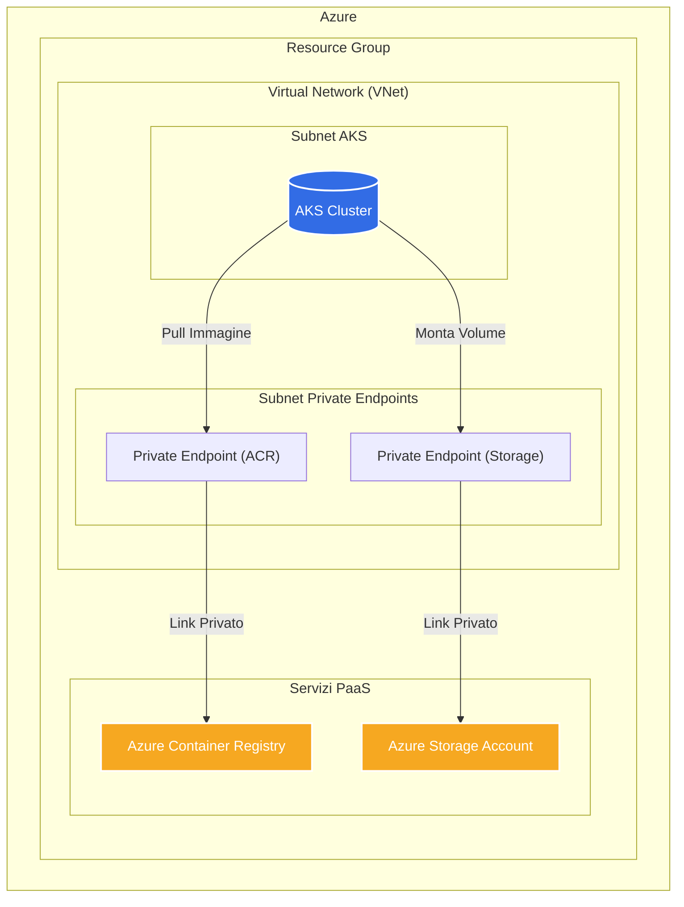

# Architettura AKS Privato con Servizi Privati

Questo progetto Terraform implementa un'architettura Azure sicura che include un cluster Azure Kubernetes Service (AKS) completamente privato, un Azure Container Registry (ACR) privato e uno Storage Account privato. Tutte le comunicazioni tra i servizi avvengono sulla rete virtuale di Azure, senza esposizione a Internet.

## Architettura

L'infrastruttura creata da questa configurazione è composta dai seguenti elementi:

- **Resource Group**: Un contenitore logico per tutte le risorse Azure.
- **Virtual Network (VNet)**: Una rete virtuale isolata in cui risiedono tutte le risorse.
- **Subnet**:
  - **Subnet AKS**: Dedicata ai nodi del cluster Kubernetes.
  - **Subnet Private Endpoints**: Dedicata a tutti i private endpoint per l'accesso privato ai servizi PaaS.
- **Network Security Group (NSG)** e **Route Table**: Applicate alla subnet di AKS per controllare il traffico.
- **Cluster AKS Privato**: Il piano di controllo (API server) non è esposto pubblicamente. Le interazioni con il cluster devono avvenire da una macchina (es. una bastion host) all'interno della stessa VNet.
- **Azure Storage Account**: Uno storage account per dati (blob, file, etc.) con accesso di rete pubblico disabilitato.
- **Azure Container Registry (ACR)**: Un registry per le immagini Docker con accesso di rete pubblico disabilitato.
- **Private Endpoints**:
  - Uno per lo Storage Account, che gli assegna un IP privato nella subnet dei PE.
  - Uno per l'ACR, che gli assegna un IP privato nella subnet dei PE.
- **Zone DNS Private**:
  - `privatelink.azurecr.io`: Per risolvere il nome dell'ACR nel suo IP privato.
  - Una per lo storage (non esplicitamente creata qui ma gestita da Azure quando si crea il PE per lo storage).

### Diagramma dell'Architettura (Mermaid)



## Come Utilizzare i Servizi Privati da Kubernetes

Poiché sia il cluster AKS che i servizi (ACR e Storage) sono collegati alla stessa VNet tramite Private Endpoints, la comunicazione è automatica e sicura all'interno della rete privata.

### 1. Utilizzare l'Azure Container Registry (ACR) Privato

Per permettere al cluster AKS di scaricare immagini dal tuo ACR privato in modo sicuro, è necessario associare l'ACR al cluster. Questo concede all'identità gestita di AKS i permessi necessari (`AcrPull`) sul registry.

**Comando di Associazione (da eseguire una tantum):**
Sostituisci i valori tra parentesi con i nomi delle tue risorse (puoi prenderli dagli output di Terraform).

```bash
az aks update --name <aks_cluster_name> --resource-group <resource_group_name> --attach-acr <acr_name>
```

Una volta eseguito questo comando, puoi fare riferimento alle immagini nel tuo ACR direttamente nei manifest dei tuoi pod, come in questo esempio:

**Esempio Pod (`pod-acr-example.yaml`):**
Assicurati di sostituire `<acr_login_server>` con il `login_server` del tuo ACR (disponibile negli output di Terraform).

```yaml
apiVersion: v1
kind: Pod
metadata:
  name: my-app
spec:
  containers:
  - name: my-app-container
    image: <acr_login_server>/my-app-image:latest
    ports:
    - containerPort: 80
```

Quando applichi questo manifest, Kubelet sui nodi AKS contatterà l'ACR tramite il suo private endpoint, risolverà il nome tramite la zona DNS privata e scaricherà l'immagine in modo sicuro.

### 2. Utilizzare lo Storage Account Privato

Per usare lo storage a oggetti (blob) all'interno di un pod, si utilizza il driver CSI (Container Storage Interface) di Azure Blob. Questo permette di montare un container di blob come un volume effimero direttamente nel file system del pod.

**Prerequisiti:**
Il driver CSI per Blob Storage deve essere abilitato sul tuo cluster. Puoi farlo con il seguente comando:
```bash
az aks enable-addons --addons azure-blob-csi-driver --name <aks_cluster_name> --resource-group <resource_group_name>
```

**Esempio Pod (`pod-storage-example.yaml`):**
Questo manifest mostra come montare un container di blob chiamato `my-data-container` in un pod. Il pod potrà leggere e scrivere file in `/mnt/data` come se fosse una cartella locale.

```yaml
apiVersion: v1
kind: Pod
metadata:
  name: my-blob-pod
spec:
  containers:
  - name: my-container
    image: mcr.microsoft.com/cbl-mariner/base/core:2.0
    command:
      - "sleep"
      - "3600"
    volumeMounts:
      - name: blob-volume
        mountPath: /mnt/data
  volumes:
  - name: blob-volume
    csi:
      driver: blob.csi.azure.com
      volumeAttributes:
        # Sostituisci con il nome del tuo storage account e del container
        storageAccount: <storage_account_name>
        containerName: my-data-container
        # Se usi un segreto per l'autenticazione (consigliato)
        # secretName: azure-storage-secret
        # Se usi l'identità del pod (ancora più sicuro)
        # msiendpoint: "..."
```

**Autenticazione:**
Il pod ha bisogno delle credenziali per accedere allo storage. L'approccio più sicuro è usare l'**identità del pod (Pod Identity)**, che associa un'identità gestita di Azure a un pod Kubernetes. In alternativa, puoi creare un segreto Kubernetes contenente la connection string o la chiave di accesso dello storage account. Poiché il pod e lo storage sono sulla stessa VNet, il traffico avverrà tramite il private endpoint.
